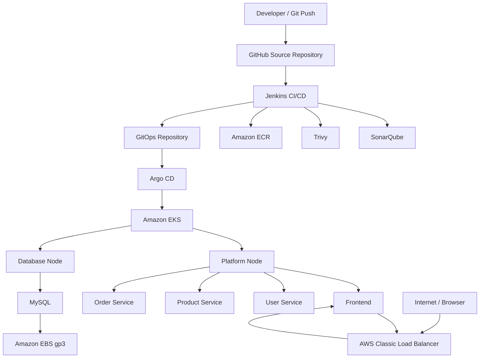

# DevSecOps Microservices Platform on AWS EKS

A hands-on DevSecOps project demonstrating CI/CD, code quality analysis, container security scanning, Amazon ECR image management, Kubernetes deployment, persistent storage, and GitOps-based delivery to Amazon EKS.

> **Project focus:** Jenkins CI/CD, SonarQube, Trivy, Docker, Amazon ECR, Amazon EKS, Kubernetes, Argo CD, MySQL, AWS EBS, and AWS Load Balancing.

---

## Table of Contents

- [Overview](#overview)
- [Objectives](#objectives)
- [Architecture](#architecture)
- [Technology Stack](#technology-stack)
- [Application Components](#application-components)
- [Repository Structure](#repository-structure)
- [CI/CD Workflow](#cicd-workflow)
- [Jenkins Pipeline](#jenkins-pipeline)
- [SonarQube](#sonarqube)
- [Trivy](#trivy)
- [Amazon ECR](#amazon-ecr)
- [Amazon EKS](#amazon-eks)
- [Kubernetes Workloads](#kubernetes-workloads)
- [MySQL and Persistent Storage](#mysql-and-persistent-storage)
- [Argo CD GitOps](#argo-cd-gitops)
- [AWS Load Balancer](#aws-load-balancer)
- [Networking](#networking)
- [Troubleshooting](#troubleshooting)
- [Validation and Proof of Work](#validation-and-proof-of-work)
- [Security Considerations](#security-considerations)
- [Lessons Learned](#lessons-learned)
- [Known Limitations](#known-limitations)
- [Future Improvements](#future-improvements)
- [Reproduction Guide](#reproduction-guide)
- [Interview Discussion Points](#interview-discussion-points)
- [Project Status](#project-status)
- [Author](#author)

---

# Overview

This project implements a practical DevSecOps delivery workflow for a containerized Python Flask microservices application.

The application consists of:

- Frontend service
- User service
- Product service
- Order service
- MySQL database

The services are containerized using Docker and deployed to Amazon EKS.

The delivery workflow integrates:

1. Git/GitHub for source control
2. Jenkins for CI/CD automation
3. SonarQube for static code analysis
4. Trivy for container vulnerability scanning
5. Amazon ECR for container image storage
6. Amazon EKS for Kubernetes orchestration
7. Argo CD for GitOps deployment
8. AWS EBS/EBS CSI for persistent database storage
9. AWS Classic Load Balancer for public access

The project was built as a hands-on lab with an emphasis on understanding the complete delivery path and troubleshooting failures rather than simply deploying an application.

---

# Objectives

## CI/CD

- Retrieve application source from Git
- Validate repository structure
- Validate dependencies
- Validate application imports
- Build Docker images
- Run SonarQube analysis
- Enforce the SonarQube Quality Gate
- Scan images with Trivy
- Tag images using the Git commit SHA
- Push images to Amazon ECR

## Kubernetes

- Create an Amazon EKS cluster
- Use multiple worker nodes
- Separate database and platform workloads
- Deploy multiple microservices
- Configure Kubernetes Services
- Configure readiness and liveness checks
- Configure persistent MySQL storage
- Use Kubernetes Secrets for database credentials
- Validate service connectivity

## GitOps

- Store Kubernetes application manifests in a Git repository
- Configure Argo CD to monitor the repository
- Synchronize Git changes to EKS
- Use Git commits as deployment versions
- Troubleshoot Argo CD reconciliation failures

## Security

- Perform static analysis with SonarQube
- Scan container images using Trivy
- Keep CI credentials outside source code
- Use ECR pull permissions for EKS nodes
- Avoid committing secrets to Git

---

# Architecture



## End-to-End Flow

```text
Git Push
   |
   v
GitHub
   |
   v
Jenkins
   |
   +--> Validation
   +--> Docker Build
   +--> SonarQube
   +--> Quality Gate
   +--> Trivy
   +--> ECR Push
   |
   v
GitOps Repository
   |
   v
Argo CD
   |
   v
Amazon EKS
   |
   +--> Frontend
   +--> User Service
   +--> Product Service
   +--> Order Service
   +--> MySQL
              |
              v
           EBS gp3
   |
   v
AWS Load Balancer
   |
   v
Public Application
```

---

# Technology Stack

| Category | Technology |
|---|---|
| Cloud | AWS |
| Region | `ap-south-1` |
| Kubernetes | Amazon EKS 1.36 |
| Containers | Docker |
| CI/CD | Jenkins |
| GitOps | Argo CD |
| Source Control | Git / GitHub |
| Static Analysis | SonarQube 9.9 |
| Security Scanning | Trivy |
| Registry | Amazon ECR |
| Database | MySQL 8.4 |
| Persistent Storage | AWS EBS gp3 |
| Storage Driver | AWS EBS CSI |
| Application | Python Flask |
| OS | Ubuntu |

---

# Application Components

| Component | Port | Kubernetes Service | Purpose |
|---|---:|---|---|
| Frontend | 5000 | `frontend:80` | Web interface |
| User Service | 5001 | `cuser-service:5001` | User/authentication APIs |
| Product Service | 5002 | `cproduct-service:5002` | Product APIs |
| Order Service | 5003 | `corder-service:5003` | Order APIs |
| MySQL | 3306 | `mysql:3306` | Database |

The frontend is externally exposed through an AWS Classic Load Balancer.

The remaining services are accessed internally through Kubernetes Services.

---

# Repository Structure

The DevSecOps implementation is maintained separately from the original application source.

A representative GitOps repository structure is:

```text
aws-eks-microservices-devsecops-gitops-platform/
│
├── README.md
│
├── apps/
│   └── devsecops/
│       ├── k8s-frontend.yaml
│       ├── k8s-user-service.yaml
│       ├── k8s-product-service.yaml
│       └── k8s-order-service.yaml
│
├── argocd/
│   └── application.yaml
│
├── infrastructure/
│   ├── eks/
│   ├── mysql/
│   └── storage/
│
├── jenkins/
│   └── Jenkinsfile
│
├── security/
│   ├── sonar-project.properties
│   └── trivy/
│
├── architecture/
│   ├── architecture.md
│   └── architecture-diagram.png
│
└── docs/
```

The exact structure may evolve as infrastructure-as-code and documentation are expanded.

> The application source originated from an existing Python Flask microservices codebase. The DevSecOps implementation, deployment configuration, CI/CD workflow, security integration, Kubernetes platform, and GitOps setup are the focus of this project. The original application's license and attribution requirements should be preserved.

---

# CI/CD Workflow

The Jenkins pipeline follows this sequence:

```text
Checkout
   ↓
Repository Validation
   ↓
Dependency Validation
   ↓
Application Import Validation
   ↓
Docker Build
   ↓
SonarQube Analysis
   ↓
Quality Gate
   ↓
Trivy Scan
   ↓
Git SHA Tagging
   ↓
Amazon ECR Push
```

The Git commit SHA is used as the immutable application image identifier.

Example:

```text
devsecops/frontend:6da3be279437
devsecops/user-service:6da3be279437
devsecops/product-service:6da3be279437
devsecops/order-service:6da3be279437
```

This provides traceability from:

```text
Source Commit
     ↓
Docker Image
     ↓
ECR
     ↓
Kubernetes Deployment
```

---

# Jenkins Pipeline

Jenkins is used as the CI/CD automation server.

The CI environment contains:

- JDK 21
- Git
- Docker
- SonarScanner
- Trivy
- AWS CLI

Credentials are stored in Jenkins Credentials rather than committed to Git.

## Pipeline Stages

### 1. Checkout

Jenkins retrieves the application source.

### 2. Repository Validation

The pipeline verifies the expected application structure and required files.

### 3. Dependency Validation

Python dependencies are checked using the application's Python 3.7 environment.

### 4. Application Import Validation

Python imports are validated to catch basic dependency or module errors.

### 5. Docker Build

Four application images are built:

```text
frontend
user-service
product-service
order-service
```

### 6. SonarQube Analysis

Source code is submitted to SonarQube.

### 7. Quality Gate

Jenkins waits for the SonarQube Quality Gate before continuing.

### 8. Trivy Scan

The locally built images are scanned for known vulnerabilities.

### 9. ECR Push

Images are tagged with the Git commit SHA and pushed to ECR.

---

# SonarQube

SonarQube provides static code analysis for the application.

The analysis covers:

```text
frontend
user-service
product-service
order-service
```

The SonarQube project is:

```text
devsecops-microservices
```

The pipeline uses:

```text
SonarScanner
    ↓
SonarQube
    ↓
Quality Gate
```

The authentication token is stored in Jenkins Credentials and is not stored in the repository.

---

# Trivy

Trivy is used for container vulnerability scanning.

The four images are scanned:

```text
frontend
user-service
product-service
order-service
```

The current pipeline focuses on:

```text
HIGH
CRITICAL
```

severity findings.

The scan output is available in Jenkins console logs as build evidence.

> The current lab implementation performs the scan and reports findings. A production pipeline should define an explicit vulnerability threshold and fail the build when that policy is violated.

---

# Amazon ECR

Four ECR repositories are used:

```text
devsecops/frontend
devsecops/user-service
devsecops/product-service
devsecops/order-service
```

Images are tagged with the Git commit SHA.

Example:

```text
6da3be279437
```

This is preferable to depending exclusively on:

```text
latest
```

because a Git SHA identifies the exact source revision associated with the image.

EKS worker nodes have permission to pull images from ECR.

---

# Amazon EKS

The Kubernetes platform is hosted on Amazon EKS.

```text
Cluster:     devsecops-eks
Region:      ap-south-1
Kubernetes:  1.36
Nodes:       2
```

The lab uses two managed worker nodes.

The node strategy separates:

```text
Database workload
        ↓
workload=database

Platform/application workloads
        ↓
workload=platform
```

## Verify Nodes

```bash
kubectl get nodes -o wide
```

## Verify Labels

```bash
kubectl get nodes --show-labels
```

---

# Kubernetes Workloads

The application namespace is:

```text
devsecops
```

The Argo CD namespace is:

```text
argocd
```

Expected application workloads:

```text
frontend
user-service
product-service
order-service
mysql
```

Validation:

```bash
kubectl -n devsecops get pods -o wide
```

Expected healthy state:

```text
frontend         1/1 Running
user-service     1/1 Running
product-service  1/1 Running
order-service    1/1 Running
mysql            1/1 Running
```

---

# Kubernetes Scheduling

The MySQL workload is placed on the database node using:

```yaml
nodeSelector:
  workload: database
```

Application workloads use:

```yaml
nodeSelector:
  workload: platform
```

This demonstrates deliberate workload placement using Kubernetes node labels.

---

# Kubernetes Services

Kubernetes Services provide stable internal endpoints.

The architecture uses:

```text
Frontend
   |
   +--> cuser-service
   +--> cproduct-service
   +--> corder-service

Application Services
   |
   +--> user-db
   +--> product-db
   +--> order-db
   |
   v
MySQL
```

Pod IP addresses are not used as permanent application configuration.

---

# Health Checks

The application deployments use TCP-based readiness and liveness checks.

Ports:

```text
frontend       5000
user-service   5001
product        5002
order          5003
```

Example:

```yaml
readinessProbe:
  tcpSocket:
    port: 5000

livenessProbe:
  tcpSocket:
    port: 5000
```

TCP probes were used because the deployed application image reliably exposed the service ports while the expected HTTP health endpoints were not consistently available in the deployed image.

---

# MySQL and Persistent Storage

MySQL is deployed as a single-replica workload.

Persistent storage uses:

```text
MySQL
  ↓
PersistentVolumeClaim
  ↓
gp3 StorageClass
  ↓
AWS EBS
  ↓
EBS CSI Driver
```

Database PVC:

```text
mysql-pvc
```

Configuration:

```text
Size:           5Gi
Storage Class:  gp3
Access Mode:    ReadWriteOnce
```

The MySQL deployment uses a `Recreate` strategy because the lab database uses a single persistent volume.

---

# Database Structure

The application uses logical databases for the different service domains:

```text
devsecops
user
product
order
```

The application services connect through Kubernetes Service names.

Example:

```text
user-service
     ↓
user-db:3306
     ↓
MySQL

product-service
     ↓
product-db:3306
     ↓
MySQL

order-service
     ↓
order-db:3306
     ↓
MySQL
```

---

# Argo CD GitOps

Argo CD continuously reconciles the Kubernetes state against the GitOps repository.

Application:

```text
devsecops-microservices
```

Source:

```text
aws-eks-microservices-devsecops-gitops-platform
```

Application path:

```text
apps/devsecops
```

Destination namespace:

```text
devsecops
```

## GitOps Flow

```text
Git Commit
    ↓
GitOps Repository
    ↓
Argo CD detects desired-state change
    ↓
Argo CD sync
    ↓
Kubernetes API
    ↓
EKS workloads
```

The Application is configured for automated synchronization and self-healing.

---

# Argo CD Troubleshooting

A significant troubleshooting exercise occurred when the Argo CD Application remained:

```text
OutOfSync
```

Investigation showed that:

```text
argocd-application-controller
```

was in:

```text
CrashLoopBackOff
```

with:

```text
OOMKilled
Exit Code: 137
```

The controller had an overly restrictive memory limit for the workload.

The resource configuration was adjusted and the controller pod was recreated.

After recovery:

```text
argocd-application-controller   1/1 Running
```

Argo CD then successfully reconciled the application:

```text
Synced
Healthy
```

## Troubleshooting Process

```text
Application OutOfSync
        ↓
Check Argo CD status
        ↓
Check controller pod
        ↓
CrashLoopBackOff
        ↓
Inspect previous container state
        ↓
OOMKilled / Exit 137
        ↓
Inspect resources
        ↓
Increase controller memory limit
        ↓
Restart controller
        ↓
Application sync succeeds
```

This was a useful example of diagnosing the actual failure layer instead of repeatedly reapplying manifests.

---

# AWS Load Balancer

The frontend Service uses:

```yaml
type: LoadBalancer
```

AWS provisioned a Classic Load Balancer.

Traffic flow:

```text
Internet
   ↓
Classic Load Balancer :80
   ↓
EC2 NodePort :31773
   ↓
Kubernetes Service :80
   ↓
Frontend Pod :5000
```

The listener configuration is:

```text
TCP 80
  ↓
TCP 31773
```

The registered EC2 instances were verified as:

```text
InService
```

The load balancer is:

```text
internet-facing
```

The load balancer security group permits TCP port 80 from the Internet.

---

# Networking Validation

The public endpoint was tested from both the EC2 environment and a Windows client.

Successful validation returned:

```text
HTTP/1.0 200 OK
```

The Windows client also successfully established a TCP connection:

```text
TcpTestSucceeded : True
```

The application was subsequently opened in a browser through the AWS Load Balancer.

This validates:

```text
Windows Client
     ↓
Internet
     ↓
AWS DNS
     ↓
Classic Load Balancer
     ↓
NodePort
     ↓
Kubernetes Service
     ↓
Frontend Pod
     ↓
Flask
```

---

# Troubleshooting Methodology

The project emphasizes a structured troubleshooting approach:

```text
1. Observe the symptom
2. Identify the affected layer
3. Check resource status
4. Inspect events
5. Inspect logs
6. Test connectivity
7. Compare expected vs actual state
8. Identify root cause
9. Apply the smallest required change
10. Re-test
11. Document the result
```

## Example: Application Readiness Failure

Initial symptoms included application pods repeatedly restarting.

Investigation showed that HTTP health checks were returning:

```text
404
```

while the application was listening on the expected TCP ports.

The probes were changed to TCP checks.

After rollout:

```text
frontend         1/1 Running
user-service     1/1 Running
product-service  1/1 Running
order-service    1/1 Running
mysql            1/1 Running
```

---

# Useful Validation Commands

## Nodes

```bash
kubectl get nodes -o wide
```

## Labels

```bash
kubectl get nodes --show-labels
```

## Pods

```bash
kubectl -n devsecops get pods -o wide
```

## Services

```bash
kubectl -n devsecops get svc
```

## Endpoints

```bash
kubectl -n devsecops get endpoints
```

## PVCs

```bash
kubectl -n devsecops get pvc
```

## Storage Classes

```bash
kubectl get storageclass
```

## Argo CD Applications

```bash
kubectl -n argocd get applications
```

## Application Logs

```bash
kubectl -n devsecops logs deployment/frontend
kubectl -n devsecops logs deployment/user-service
kubectl -n devsecops logs deployment/product-service
kubectl -n devsecops logs deployment/order-service
```

## MySQL Logs

```bash
kubectl -n devsecops logs deployment/mysql
```

---

# Validation and Proof of Work

The project should be evaluated using implementation evidence as well as the source code.

Recommended evidence:

## Jenkins

Capture:

- Successful pipeline
- Pipeline stages
- Docker build
- SonarQube analysis
- Quality Gate
- Trivy scan
- ECR push

## SonarQube

Capture:

- `devsecops-microservices` project
- Analysis result
- Quality Gate

## Trivy

Capture:

- Container scan output
- HIGH/CRITICAL vulnerability results

## Amazon ECR

Capture:

- Four ECR repositories
- Git SHA-tagged images

## Amazon EKS

Capture:

```bash
kubectl get nodes -o wide
```

and:

```bash
kubectl -n devsecops get pods -o wide
```

## Argo CD

Capture:

```text
devsecops-microservices
Synced
Healthy
```

## GitHub

Capture:

- GitOps repository
- Kubernetes manifests
- Git commit history

## Live Application

Capture:

- Public application
- Login page
- AWS Load Balancer URL

---

# Security Considerations

This is a learning/lab environment and should not be considered a production security baseline.

## Credentials

AWS credentials are stored in Jenkins Credentials rather than source code.

SonarQube authentication is also managed through Jenkins Credentials.

Database credentials should be supplied through Kubernetes Secrets rather than committed in plaintext.

## Container Security

Container images are scanned using Trivy.

## Image Traceability

Git SHA tags provide traceability between source code and deployed images.

## ECR

EKS nodes use IAM permissions to pull private images.

## Never Commit

```text
.env
AWS access keys
AWS secret keys
kubeconfig files
SonarQube tokens
database passwords
Flask secret keys
private SSH keys
```

---

# Production Security Improvements

A production implementation should additionally consider:

- AWS Secrets Manager
- External Secrets Operator
- IAM Roles for Service Accounts
- Kubernetes NetworkPolicies
- Pod Security Standards
- Non-root containers
- Read-only root filesystem
- Resource quotas
- TLS/HTTPS
- AWS WAF
- AWS Load Balancer Controller
- Image signing
- SBOM generation
- Dependency scanning
- Strong Trivy fail thresholds
- Centralized logging
- Monitoring and alerting
- Backup and disaster recovery

---

# Lessons Learned

## 1. CI success does not guarantee deployment success

A successful Docker build and CI pipeline does not prove that Kubernetes readiness, networking, storage, or runtime dependencies are correct.

---

## 2. Logs should drive troubleshooting

An `OutOfSync` Argo CD status initially looked like a synchronization problem.

The actual failure was:

```text
argocd-application-controller
→ CrashLoopBackOff
→ OOMKilled
→ Exit 137
```

Inspecting the workload exposed the root cause.

---

## 3. Health checks must match the deployed application

A Kubernetes probe can make a healthy application appear unhealthy if it targets an unavailable endpoint.

The deployed services were therefore validated at the actual listening ports.

---

## 4. Pod IPs are ephemeral

Applications should communicate through Kubernetes Services rather than hard-coded pod addresses.

---

## 5. Git SHA image tags improve traceability

Using:

```text
service:<git-sha>
```

makes it possible to associate a deployed image with a source revision.

---

## 6. Container limits can cause failures independently of node pressure

A container may be OOM-killed because it reaches its own memory limit even when the Kubernetes node still has available memory.

This was demonstrated by the Argo CD controller incident.

---

## 7. Validate from the real client

Testing from inside EC2 is useful, but external access should also be validated from an actual Internet client.

---

# Known Limitations

This project is a constrained learning/lab implementation.

Current limitations include:

- Single-replica application workloads
- Single MySQL instance
- No production-grade MySQL high availability
- No HTTPS/TLS on the public endpoint
- Classic Load Balancer rather than a production ingress architecture
- Trivy scanning is not yet configured with a strict fail threshold
- Some optional Argo CD components were scaled down to conserve resources
- The original Flask application was used as the application workload
- The application UI was not redesigned as part of the DevSecOps implementation
- The project focuses primarily on the DevSecOps delivery platform rather than building the business application itself

These limitations are intentional trade-offs for a low-cost AWS lab environment.

---

# Future Improvements

## Infrastructure

- Terraform-based EKS infrastructure
- Terraform modules
- VPC as code
- Private worker subnets
- Controlled outbound Internet access
- Cluster/node autoscaling

## CI/CD

- Automated unit and integration testing
- Strict Trivy vulnerability thresholds
- SBOM generation
- Image signing
- Automated rollback
- Deployment verification

## Kubernetes

- Horizontal Pod Autoscaler
- PodDisruptionBudgets
- NetworkPolicies
- ResourceQuota
- LimitRange
- Pod security controls
- Multi-environment namespaces

## Observability

- Prometheus
- Grafana
- Centralized logging
- Alertmanager
- Application metrics
- Distributed tracing

## Security

- AWS Secrets Manager
- External Secrets Operator
- IAM Roles for Service Accounts
- TLS certificates
- AWS WAF
- Image signing and verification
- Runtime security

## GitOps

- Development/staging/production environments
- Kustomize or Helm
- Automated image updates
- Progressive delivery
- Canary deployments
- Automated rollback

---

# Reproduction Guide

## 1. Prepare AWS

Create:

```text
VPC
Subnets
Security Groups
IAM
EKS
Managed Node Groups
```

---

## 2. Create Worker Nodes

Use two worker nodes for the lab.

Apply labels:

```bash
kubectl label node <database-node> workload=database
kubectl label node <platform-node> workload=platform
```

Verify:

```bash
kubectl get nodes --show-labels
```

---

## 3. Configure Storage

Install/configure the AWS EBS CSI driver.

Create a `gp3` StorageClass.

Create the MySQL PVC.

Verify:

```bash
kubectl get pvc -n devsecops
```

---

## 4. Deploy MySQL

Create:

```text
Secret
PVC
Deployment
Service
```

Verify:

```bash
kubectl -n devsecops get pods
kubectl -n devsecops get svc
```

---

## 5. Build Images

Build:

```text
frontend
user-service
product-service
order-service
```

---

## 6. Run Jenkins

Configure Jenkins credentials for:

```text
SonarQube
Amazon ECR
```

Run the pipeline and verify:

```text
Build successful
SonarQube analysis successful
Quality Gate successful
Trivy scan completed
ECR push successful
```

---

## 7. Configure GitOps

Store Kubernetes application manifests in Git.

Example:

```text
apps/devsecops/
```

Configure Argo CD to use this repository.

---

## 8. Configure Argo CD

Create an Application pointing to:

```text
Git repository
    ↓
apps/devsecops
    ↓
devsecops namespace
```

Enable automated synchronization where appropriate.

---

## 9. Validate EKS

```bash
kubectl -n devsecops get pods -o wide
kubectl -n devsecops get svc
kubectl -n devsecops get endpoints
```

---

## 10. Validate Public Access

Retrieve the Load Balancer:

```bash
kubectl -n devsecops get svc frontend
```

Test:

```bash
curl -I http://<load-balancer-hostname>/
```

Expected:

```text
HTTP/1.0 200 OK
```

Then validate the same endpoint from an external browser.

---

# Interview Discussion Points

This project can be used to discuss practical DevOps topics.

## CI/CD

- Why Jenkins?
- What happens after a Git push?
- Why is the Quality Gate before ECR push?
- How are credentials managed?
- Why use Git SHA image tags?

## Docker

- How are the services containerized?
- What is the difference between an image and a container?
- How does Trivy scan an image?
- What happens when a container exits?

## Kubernetes

- Pod vs Deployment vs Service
- ClusterIP vs NodePort vs LoadBalancer
- Readiness vs liveness probes
- Requests vs limits
- Node selectors
- PVC vs PV
- Kubernetes DNS
- Rollouts and rollbacks

## AWS

- EKS architecture
- Managed node groups
- ECR authentication
- EBS CSI
- Security Groups
- Classic Load Balancer
- NodePort traffic flow
- IAM permissions

## GitOps

- What is GitOps?
- Why Argo CD?
- Desired state vs actual state
- Pull-based deployment
- Automated synchronization
- Self-healing
- Drift detection

## Troubleshooting

A strong example from this project:

```text
Symptom:
Application stuck OutOfSync

Investigation:
Argo CD controller was CrashLooping

Root cause:
Controller memory limit was too low

Fix:
Adjusted resources and restarted controller

Result:
Argo CD successfully reconciled the application
```

Another example:

```text
Symptom:
Application pods were not becoming Ready

Investigation:
HTTP probes returned 404

Root cause:
Probe endpoint did not match the deployed image

Fix:
Changed probes to TCP checks on service ports

Result:
All application pods became Ready
```

---

# Project Status

## Implemented

- [x] Dockerized Flask microservices
- [x] Jenkins CI/CD pipeline
- [x] Repository validation
- [x] Dependency validation
- [x] Application import validation
- [x] Docker builds
- [x] SonarQube analysis
- [x] SonarQube Quality Gate
- [x] Trivy scanning
- [x] Amazon ECR repositories
- [x] Git SHA image tagging
- [x] Amazon EKS cluster
- [x] Two-node workload separation
- [x] Kubernetes Deployments
- [x] Kubernetes Services
- [x] MySQL deployment
- [x] Persistent EBS-backed storage
- [x] AWS EBS CSI integration
- [x] Argo CD GitOps
- [x] Automated synchronization
- [x] Kubernetes troubleshooting
- [x] AWS Load Balancer exposure
- [x] External browser validation

## Planned

- [ ] Terraform infrastructure
- [ ] HTTPS/TLS
- [ ] Production ingress architecture
- [ ] Strict Trivy enforcement
- [ ] AWS Secrets Manager integration
- [ ] NetworkPolicies
- [ ] Prometheus/Grafana
- [ ] Automated application testing
- [ ] High availability
- [ ] Production-grade database architecture

---

# Conclusion

This project demonstrates an end-to-end DevSecOps workflow for delivering a containerized microservices application to Amazon EKS.

The complete platform connects:

```text
GitHub
   ↓
Jenkins
   ↓
SonarQube
   ↓
Trivy
   ↓
Amazon ECR
   ↓
GitOps Repository
   ↓
Argo CD
   ↓
Amazon EKS
   ↓
Kubernetes Services
   ↓
MySQL + EBS
   ↓
AWS Load Balancer
   ↓
Public Application
```

The main engineering objective is understanding how these layers interact and how to diagnose failures across CI/CD, containers, Kubernetes, AWS networking, storage, and GitOps.

---

# Author

**Raguraaman V M**

DevOps / Cloud Engineering Project

- GitHub: `https://github.com/RaguraamanVM`
- LinkedIn: `https://linkedin.com/in/raguraaman`
- Portfolio: `https://raguraamanvm.github.io/raguraaman-portfolio-website/`

---

## Attribution

The application used in this project originated from an existing Python Flask microservices codebase. This repository primarily demonstrates the DevSecOps engineering and deployment platform built around that application.

The original project's license, copyright notices, and attribution requirements should be retained and respected.
